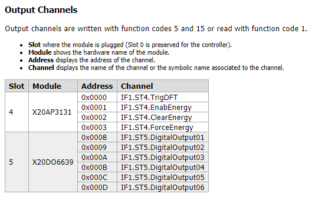
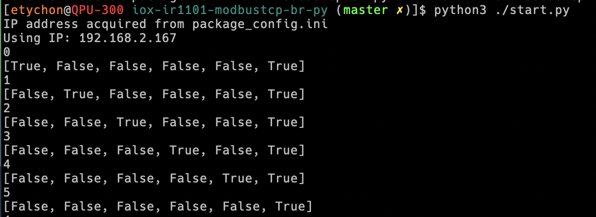

# Cisco IOx application example to use Modbus TCP on a Cisco IR1101 with Python

The purpose of this sample code is to showcase how you can very simply access Modbus TCP Programmable Logic Controllers (PLC) from a Python 3 environment and run it on Cisco IOx.

Our aim in this case is simply to trigger a few Modbus coil registers on and off and have some fun doing the visual effect of Kitt in Knight Rider, on a PLC!

Cisco IOx is an execution and hosting environment and in this case we will build an application package for the Cisco IR1101 which is a ARM-based platform. For this reason we will need to include QEMU for cross-compilation on an Intel x86_64 platform. For more information on how to set-up your machine check "[Build and Deploy a Docker IOx Package for the IR1101 ARM Architecture](https://www.cisco.com/c/en/us/support/docs/routers/1101-industrial-integrated-services-router/214383-build-and-deploy-a-docker-iox-package-fo.html)".

This sample is using Python 3 along with the [pyModbusTCP](https://github.com/sourceperl/pyModbusTCP) library which is an extremely compact implementation.


## Use Case Description

In this code sample we are going to simulate Kitt, with the back and forth light flashing on a PLC. This is not very useful per se, however the purpose is to show how to set this up so you can embark on much more useful use cases.

## Prerequisites

* You need a PLC or anything that can act as a Modbus Master. In this case I have used a PLC from [B&R](https://www.br-automation.com/en/) which provides Modbus TCP data. Note that this PLC requires [programming the Modbus table with B&R "Automation Studio"](https://www.youtube.com/watch?v=L-oFOQl-hBM&t=217s), and once this step is done then you can view the Modbus registers to use.
* You need a device with Cisco IOx. In this case I have used a Cisco Industrial Router IR1101, but you could also use Cisco Industrial Ethernet IE3400 with minimal or no change. The gateway need to be configured to give access to your containers to the local network or wherever is your PLC.
* You need a build machine with internet access and Docker, ioxclient, and git.

## Getting the IR1101 ready with IOx

Although covered in the Cisco IOS-XE documentation, here's a quick run down on how to set up IOx networking. On the IR1101 all IOx containers will be presented as being connected to interface `VirtualPortGroup0`. We will use a dynamic DHCP pool to assign containers an IP address and Network Address Translation (NAT) to masquerade the IP traffic.

You need to [get access to the router console](https://www.cisco.com/c/en/us/td/docs/routers/access/1101/software/configuration/guide/b_IR1101config/b_IR1101config_chapter_011.html) to enter those commands.

The external, public interface will be the main `GigabitEthernet0/0/0` port. It will take it's IP address from an external DHCP server, but of course you can also assign a static IP address. Here is an example with DHCP:

```
interface GigabitEthernet0/0/0
 ip address dhcp
 ip nat outside
```

Then configure the `VirtualPortGroup0` interface with an IP address and as NAT inside. All containers will appear as being connected to that network:

```
 interface VirtualPortGroup0
 ip address 192.168.1.1 255.255.255.0
 ip nat inside
```

For our containers to receive an IP address, we then need to also configure a DHCP pool:

```
ip dhcp pool iox
 network 192.168.1.0 255.255.255.0
 default-router 192.168.1.1
 dns-server 8.8.8.8
```

You can also use a static IP address for the container during the activation phase, and skip the DHCP server configuration. This will allow the container to always come back with the same IP address which may be interesting when doing port forwarding. When not doing port forwarding the DHCP method is the most simple one.

Since this container also need access to the external network where our PLC is configured, we also need to configure Network Address Translation (NAT) to "hide" our private IP address as if it was coming from the router's public interface. Here's how to do that:

```
ip access-list extended 100
    10 permit ip 192.168.1.0 0.0.0.255 any

ip nat inside source list 100 interface GigabitEthernet0/0/0 overload
```

## Installation

On your build machine start by cloning the repo with:

```
  git clone https://github.com/etychon/iox-ir1101-modbustcp-br-py
```

In the `start.py` main program, change the base address on your Coil address. This information is coming from the [Modbus Exchange Table which describes the type, size and address of the registers](https://en.wikipedia.org/wiki/Modbus#Modbus_object_types).

In my case the table was generated by the B&R "Automation Studio" software and the output was like so:



My Digital Output module in slot 5 has a base address of 0x0008 and six output, with one bit per output. We will then configure the register and number of output in the `start.py` program by changing to the base address `r_addr_hex` to 0x0008 and the maximum register number to 5 (6 registers from 0 to 5, so maximum is 5):

```
  r_addr_hex = "0008"
  max_registers = 5;
```

As an exercise you can make those parameters configurable through the `package_config.ini` configuration file. Currently it is being used only to configure the PLC IP address after the application activation and before execution. This process called "bootstrapping" in Cisco IOx allows application parameters to be changed without touching the container itself.

For example in this case the `package_config.ini` file contains an IP address that can be changed to match your PLC IP address:

```
[PLC]
IP_Address:192.168.2.167
```

After the IP address has been changed and before going further you can check if this runs properly on your PLC with:



You can now proceed with building your Docker image:

  `docker build -t iox-ir1101-modbustcp-br-py .`

Similarly you can validate that the image runs well as a Docker container with:

  `docker run iox-ir1101-modbustcp-br-py`

Now is the time to package this image as an IOx application using Cisco ioxclient utility, which takes additional information from the resource descriptor file `package.yaml`. This file describes the target architecture, network and resource requirements, description and version.

`ioxclient docker package iox-ir1101-modbustcp-br-py . -n iox-ir1101-modbustcp-br-py --use-targz`

Your Cisco IOx application is now in the current directory and called `iox-ir1101-modbustcp-br-py.tar.gz`.

## Usage


Show users how to use the code. Be specific.
Use appropriate formatting when showing code snippets or command line output.

### DevNet Sandbox

A great way to make your repo easy for others to use is to provide a link to a [DevNet Sandbox](https://developer.cisco.com/site/sandbox/) that provides a network or other resources required to use this code. In addition to identifying an appropriate sandbox, be sure to provide instructions and any configuration necessary to run your code with the sandbox.

## How to test the software

Provide details on steps to test, versions of components/dependencies against which code was tested, date the code was last tested, etc.
If the repo includes automated tests, detail how to run those tests.
If the repo is instrumented with a continuous testing framework, that is even better.


## Known issues

Document any significant shortcomings with the code. If using [GitHub Issues](https://help.github.com/en/articles/about-issues) to track issues, make that known and provide any templates or conventions to be followed when opening a new issue.

## Getting help

Instruct users how to get help with this code; this might include links to an issues list, wiki, mailing list, etc.

**Example**

If you have questions, concerns, bug reports, etc., please create an issue against this repository.

## Getting involved

This section should detail why people should get involved and describe key areas you are currently focusing on; e.g., trying to get feedback on features, fixing certain bugs, building important pieces, etc. Include information on how to setup a development environment if different from general installation instructions.

General instructions on _how_ to contribute should be stated with a link to [CONTRIBUTING](./CONTRIBUTING.md) file.


----

## Licensing info

A license is required for others to be able to use your code. An open source license is more than just a usage license, it is license to contribute and collaborate on code. Open sourcing code and contributing it to [Code Exchange](https://developer.cisco.com/codeexchange/) or [Automation Exchange](https://developer.cisco.com/automation-exchange/) requires a commitment to maintain the code and help the community use and contribute to the code.

Choosing a license can be difficult and depend on your goals for your code, other licensed code on which your code depends, your business objectives, etc.   This template does not intend to provide legal advise. You should seek legal counsel for that. However, in general, less restrictive licenses make your code easier for others to use.

> Cisco employees can find licensing options and guidance [here](https://wwwin-github.cisco.com/eckelcu/DevNet-Code-Exchange/blob/master/GitHubUsage.md#licensing-guidance).

Once you have determined which license is appropriate, GitHub provides functionality that makes it easy to add a LICENSE file to a GitHub repo, either when creating a new repo or by adding to an existing repo.

When creating a repo through the GitHub UI, you can click on *Add a license* and select from a set of [OSI approved open source licenses](https://opensource.org/licenses). See [detailed instructions](https://help.github.com/articles/licensing-a-repository/#applying-a-license-to-a-repository-with-an-existing-license).

Once a repo has been created, you can easily add a LICENSE file through the GitHub UI at any time. Simply select *Create New File*, type *LICENSE* into the filename box, and you will be given the option to select from a set of common open source licenses. See [detailed instructions](https://help.github.com/articles/adding-a-license-to-a-repository/).

Once you have created the LICENSE file, be sure to update/replace any templated fields with appropriate information, including the Copyright. For example, the [3-Clause BSD license template](https://opensource.org/licenses/BSD-3-Clause) has the following copyright notice:

`Copyright (c) <YEAR>, <COPYRIGHT HOLDER>`

See the [LICENSE](./LICENSE) for this template repo as an example.

Once your LICENSE file exists, you can delete this section of the README, or replace the instructions in this section with a statement of which license you selected and a link to your license file, e.g.

This code is licensed under the BSD 3-Clause License. See [LICENSE](./LICENSE) for details.

Some licenses, such as Apache 2.0 and GPL v3, do not include a copyright notice in the [LICENSE](./LICENSE) itself. In such cases, a NOTICE file is a common place to include a copyright notice. For a very simple example, see [NOTICE](./NOTICE).

In the event you make use of 3rd party code, it is required by some licenses, and a good practice in all cases, to provide attribution for all such 3rd party code in your NOTICE file. For a great example, see [https://github.com/cisco/ChezScheme/blob/master/NOTICE](https://github.com/cisco/ChezScheme/blob/master/NOTICE).   

----

## Credits and references

1. Projects that inspired you
2. Related projects
3. Books, papers, talks, or other sources that have meaningful impact or influence on this code
